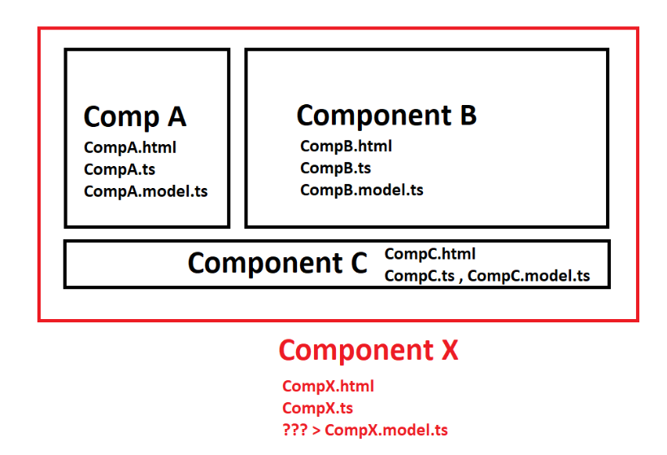

# ANGULAR PROJE MİMARİSİ


Yukardaki diagrama baktığımzda, Anguların temel yapı bileşenlerini göreceğiz. tek tek inceleyelim.

---

---

## 1-MODULE

Angular uygulamaları modüler bir yapıya sahiptir ve Angular, kendi modül sistemine "NgModule" adını vermiştir. Bu sistem, Angular uygulamalarının organizasyonu ve yönetimi önemlidir.

1. **Declarations (Deklarasyonlar)**

- **Ne Anlama Gelir ?** Bu özellik, Angular modülünüz içinde tanımladığınız bileşenleri (components), direktifleri (directives) ve boruları (pipes) listeler. Bu öğeler, modülün kendi içinde kullanılabilir.
- **Örnek Kullanım:** Eğer bir modül içinde `HeaderComponent`, `FooterComponent` ve `MainComponent` gibi bileşenler tanımladıysanız, bu bileşenleri `declarations` array'inde listelersiniz.

2. **Exports (Dışa Aktarmalar)**

- **Ne Anlama Gelir ?** Bu özellik, modülünüzde tanımlanan bileşen veya direktiflerin başka modüller tarafından kullanılabilmesi için dışa aktarıldığını belirtir. Bir öğeyi dışa aktarmak, onu modülünüz dışında kullanılabilir hale getirir.

- **Örnek Kullanım:** Eğer bir classı modülü herhangi bir yerde kullanacaksak bunu export keywordü veya exports arrayi ile dışarı aktarmak gerekir.

3. **Imports (İçe Aktarmalar)**

- **Ne Anlama Gelir ?** Bu özellik, modülünüzün başka modüllerden (Angular'ın yerleşik modülleri veya üçüncü parti modüller) özellikler kullanabilmesi için gerekli olan modülleri listeler.

- **Örnek Kullanım:** Form işlemleri için `FormsModule` veya uygulamanızda yönlendirme işlevselliği için `RouterModule` kullanmak istiyorsanız, bu modülleri imports array'ine eklemeniz gerekecektir.

```javascript
import { Component } from '@angular/core';
import { FormsModule } from '@angular/forms';
import { RouterOutlet } from '@angular/router';

@Component({
  imports: [RouterOutlet , FormsModule],
})
```

4. **Providers (Sağlayıcılar)**

- **Ne Anlama Gelir ?** Bu özellik, modülünüz içinde oluşturulan servisleri (services) veya herhangi bir değeri, Angular'ın bağımlılık enjeksiyon sistemine kaydeder. Bu sayede, uygulamanızın farklı kısımlarında bu servislerden yararlanabilirsiniz.

- **Örnek Kullanım:** Eğer modülünüz bir `DataService` sağlıyorsa, bu servisi `providers` array'ine ekleyerek, modülünüzün veya uygulamanızın farklı bölümlerinde kullanılabilir hale getirebilirsiniz.

```javascript
import DataService from '../services/DataService';

@NgModule({
  providers: [
    DataService
  ]
})
```

4. **Bootstrap (Başlatma)**

- **Ne Anlama Gelir ?** Bu özellik, uygulamanın başlatıldığı zaman yüklenmesi gereken kök bileşenin adını belirtir. Genellikle, bu özellik yalnızca ana modülde (çoğunlukla AppModule olarak adlandırılır) kullanılır.

- **Örnek Kullanım:** Uygulamanızın ana bileşeni `AppComponent` ise, bu bileşeni `bootstrap` array'inde belirtirsiniz. Bu, uygulama yüklendiğinde `AppComponent`'in tarayıcıda görüntülenmesini sağlar.

```javascript
import { bootstrapApplication } from "@angular/platform-browser";
import { appConfig } from "./app/app.config";
import { AppComponent } from "./app/app.component";

bootstrapApplication(AppComponent, appConfig).catch((err) =>
  console.error(err)
);
```

---

---

## 2-COMPONENTS

Angular'da component'ler, kullanıcı UI en temel yapı taşlarıdır. Her bir component, bir view'ı kontrol eder ve bu view, component ile ilişkilendirilmiş bir template ile tanımlanır.



1. **Selector (Seçici)**

- **Ne Anlama Gelir ?** `@Component` dekoratöründe selector özelliği, `component`'inizi bir HTML etiketi olarak nasıl kullanacağınızı tanımlar. Bu şekilde adlandırma yaparak dışarda erişime açmış oluruz.

- **Örnek Kullanım:** Eğer selector'ınız `app-root` ise, bu component'i bir HTML sayfasında `<app-root></app-root>` şeklinde kullanabilirsiniz.

```javascript
@Component({
  selector: 'app-root',
})
```

2. **templateUrl**

- **Ne Anlama Gelir ?** `templateUrl`, component'in görünümünü tanımlayan harici bir HTML dosyasının yolunu belirtir. Bu, daha temiz bir kod organizasyonu sağlar ve genellikle daha büyük HTML yapıları için tercih edilir.

- **Örnek Kullanım:** `templateUrl: './app.component.html'` şeklinde kullanılarak, `app.component.html` dosyasındaki HTML Bu componente bağlanır.

```javascript
@Component({
  selector: 'app-root',
  templateUrl: './app.component.html',
})
```

3. **templateUrl**

- **Ne Anlama Gelir ?** Eğer component'in HTML içeriği oldukça küçükse ve harici bir dosyada tutmanın gereksiz olduğunu düşünüyorsanız, template özelliğini kullanabilirsiniz. Bu, HTML içeriğinizi doğrudan TypeScript dosyanız içerisinde tanımlamanıza olanak tanır.

- **Örnek Kullanım:** `template`: `'<p>Hello, World!</p>'` şeklinde, component'in görünümü için doğrudan HTML tanımlayabilirsiniz.

```javascript
@Component({
  selector: 'app-root',
  template: `'<p>Hello, World!</p>'`,
})
```

4. **styleUrls**

- **Ne Anlama Gelir ?** `styleUrls`, component için kullanılacak CSS stil dosyalarının listesini içerir.

- **Örnek Kullanım:** `styleUrls: ['./app.component.css']` kullanımıyla, app.component.css dosyasındaki stil bilgileri, AppComponent ile ilişkilendirilir.

```javascript
@Component({
  selector: 'app-root',
  template: `'<p>Hello, World!</p>'`,
  styleUrl: './app.component.css'
})
```

5. **styles**

- **Ne Anlama Gelir ?** Eğer component'iniz için sadece birkaç stil tanımı yapacaksanız ve bunları ayrı bir dosyada tutmanın gereksiz olduğunu düşünüyorsanız, styles özelliğini kullanabilirsiniz.

- **Örnek Kullanım:** `styles: ['p { color: blue; }']` şeklinde, component'iniz için doğrudan dahili CSS stil tanımları yapabilirsiniz.

```javascript
@Component({
  selector: 'app-root',
  template: `'<p>Hello, World!</p>'`,
  styles: ['p { color: blue; }']
})
```

---

---

## 3-TEMPLATE

Angular'da bir template, bir component'in kullanıcı arayüzünü tanımlayan HTML biçimidir. Bu template'ler, HTML ile birlikte Angular'ın kendi direktifleri, bağlama sözdizimi ve template referans değişkenleri gibi özellikleri kullanır.

```javascript
import { Component } from "@angular/core";

@Component({
  selector: "app-sayhello",
  template: ` <h1>Hello, {{ name }}!</h1> `,
})
export class HelloComponent {
  name: string = "Baris";
}
```

---

---

## 4-DATA BİNDİNG


Angular'da data binding (veri bağlama) mekanizmaları, componentları template'leri ile onların TypeScript sınıfları arasında veri akışını yönetir. dört temel data binding vardır.

1. **İnterpolasyon ({{ value }})**

- **Ne Anlama Gelir ?** İnterpolasyon, component classındaki bir değeri HTML template'inde göstermek için kullanılır.

- **Örnek Kullanım:** Eğer component sınıfınızda title = 'Merhaba Dünya'; şeklinde bir özellik tanımladıysanız, bu değeri HTML template'inde {{ title }} şeklinde kullanabilirsiniz. Bu, ekranda "Merhaba Dünya" metninin görünmesini sağlar.

```javascript
// app.component.ts
import { Component } from "@angular/core";

@Component({
  selector: "app-root",
  templateUrl: "./app.component.html",
})
export class AppComponent {
  title: string = "Merhaba Dünya";
}
```

```javascript
// app.component.html

<p>{{ title }}</p>
```

2. **Property Binding ([property]="value")**

- **Ne Anlama Gelir ?** Property binding, bir HTML elementinin özelliklerini (properties) component sınıfınızdaki değerlere bağlamak için kullanılır. Bu, özellikle DOM özelliklerini dinamik olarak güncellemeniz gerektiğinde kullanışlıdır.

- **Örnek Kullanım:** Eğer bir <div> elementinin hidden özelliğini kontrol etmek istiyorsanız, [hidden]="isHidden" şeklinde bir property binding kullanılabilir.

```javascript
// app.component.ts
import { Component } from "@angular/core";

@Component({
  selector: "app-root",
  templateUrl: "./app.component.html",
})
export class AppComponent {
  isHidden: boolean = false;
}
```

```html
<!-- app.component.html -->

<div [hidden]="isHidden">Hidden message</div>
<button (click)="isHidden = !isHidden">Message Show/Hidde</button>
```

3. **Event Binding ((event)="handler()")**

- **Ne Anlama Gelir ?** Event binding, DOM olaylarını (örneğin, kullanıcı tıklamaları, klavye olayları vb.) component sınıfınızdaki bir fonksiyona bağlamak için kullanılır. Bu, kullanıcı etkileşimlerini dinlemek ve buna göre tepki vermek için gereklidir.

- **Örnek Kullanım:** Bir butona tıklama olayını yakalamak için, <button (click)="onButtonClick()">Tıkla</button> şeklinde bir event binding kullanabilirsiniz. Burada onButtonClick() bir metodtur ve kullanıcı butona her tıkladığında çağrılır.

```javascript
// app.component.ts
import { Component } from "@angular/core";

@Component({
  selector: "app-root",
  templateUrl: "./app.component.html",
})
export class AppComponent {
  onButtonClick() {
    console.log("Butona tıklandı!");
  }
}
```

```html
<!-- app.component.html -->
<button (click)="onButtonClick()">Tıkla</button>
```

4. **Two-way Data Binding ([(ngModel)]="property")**

- **Ne Anlama Gelir ?** İki yönlü veri bağlama, verinin template ve component sınıfı arasında karşılıklı olarak senkronize edilmesini sağlar.

- **Örnek Kullanım:** Bir input elementinde kullanıcı tarafından girilen değeri gerçek zamanlı olarak bir component özelliğiyle senkronize etmek için, <input [(ngModel)]="userInput"> şeklinde iki yönlü bir veri bağlama kullanabilirsiniz.

```javascript
// app.component.ts
import { Component } from "@angular/core";
import { FormsModule } from "@angular/forms";
import { RouterOutlet } from "@angular/router";

@Component({
  selector: "app-root",
  standalone: true,
  imports: [RouterOutlet, FormsModule],
  templateUrl: "./app.component.html",
  styleUrl: "./app.component.css",
})
export class AppComponent {
  userInput: string = "";
}
```

```html
<!-- app.component.html -->

<div>
  <input [(ngModel)]="userInput" placeholder="Bir şeyler yazın" />
  <p>Girdiğiniz değer: {{ userInput }}</p>
</div>
```

---

---

## 5.METADATA

Angular'da components, directives, pipe, modules gibi sınıfların nasıl kullanılacağına dair bilgiler sağlar. Angular, bu metadata'yı, uygulamanın nasıl çalıştırılacağını ve bileşenlerin birbiriyle nasıl etkileşime gireceğini anlamak için kullanır. Metadata, decorators aracılığıyla sınıflara eklenir.

**Metadata Türleri:**

- **@Component:** Bileşenlerin görünümünü ve davranışını tanımlar. templateUrl, styleUrls, selector gibi özellikleri içerir.

- **@NgModule:** Angular modüllerini tanımlar. Uygulamanın farklı bölümlerini organize etmek için kullanılır. declarations, imports, providers, bootstrap gibi özellikleri içerir.

- **@Injectable:** Servislerin ve sağlayıcıların (providers) nasıl enjekte edileceğini tanımlar. Angular'ın bağımlılık enjeksiyon sistemi ile kullanılır.

- **@Directive:** Bileşenler gibi DOM'a müdahale eden, ancak kendi görünümleri olmayan sınıfları tanımlar. Yeniden kullanılabilir davranışlar oluşturmak için kullanılır.

- **@Pipe:** Verileri dönüştürmek için kullanılan sınıfları tanımlar. Örneğin, tarihleri, para birimlerini formatlamak veya metinleri kısaltmak için kullanılır.

---

---

## 6-DİRECTİVE

Angular, uygulamanızın kullanıcı arayüzünü dinamik ve interaktif hale getirmek için direktifler (directives) kullanır. Direktifler, DOM üzerinde değişiklik yapmanıza olanak tanıyan güçlü araçlardır. Angular'da iki ana tür direktif bulunur: Yapısal Direktifler (Structural Directives) ve Nitelik Direktifleri (Attribute Directives).

1. **Yapısal Direktifler (Structural Directives):**

Yapısal direktifler, DOM'un yapısını değiştirirler. Öğeleri ekleyebilir, kaldırabilir veya yeniden düzenleyebilirler. Bu direktifler, genellikle bir asterisk (\*) işaretiyle başlar.

Örnek Kullanım:

```html
<div *ngIf="isVisible">Görünür Olacak</div>
```

```html
<ul>
  <li *ngFor="let item of items">{{ item }}</li>
</ul>
```

1. **Nitelik Direktifleri (Attribute Directives):**

Nitelik direktifleri, bir elementin görünümünü veya davranışını değiştirir, ancak yapısını değiştirmezler.

```html
<!--[ngClass]   Bir elementin sınıfını koşullu olarak ekler veya kaldırır.  -->
<div [ngClass]="{'active': isActive}">Aktif Durum</div>
```

```html
<!--[ngStyle]: Bir elementin stilini dinamik olarak ayarlamanıza olanak tanır.  -->
<div [ngStyle]="{'font-size': fontSize + 'px'}">Boyutunu Değiştir</div>
```

---

---

## 7-SERVİCE

Angular'da servisler, uygulamanın farklı bölümleri arasında veri paylaşımını kolaylaştıran ve genellikle sunucu ile iletişim kurmak için kullanılan yeniden kullanılabilir kod parçalarıdır. Servisler, `@Injectable()` dekoratörü ile tanımlanır. Bu dekoratör, Angular'ın bağımlılık enjeksiyon sistemine sınıfı bir servis olarak kaydetmesine olanak tanır. Bu şekilde, servisler uygulamanın ihtiyaç duyduğu herhangi bir yerde enjekte edilebilir ve kullanılabilir.

1.  Servis oluşturma

```typescript
import { Injectable } from "@angular/core";
import { HttpClient } from "@angular/common/http";
import { Observable } from "rxjs";

@Injectable({
  providedIn: "root",
})
export class UserService {
  private apiUrl = "https://api.example.com/users";

  constructor(private http: HttpClient) {}

  getUsers(): Observable<any> {
    return this.http.get(this.apiUrl);
  }

  addUser(user: any): Observable<any> {
    return this.http.post(this.apiUrl, user);
  }
}
```

2. Servisi Bir Componentte Kullanma:

```typescript
import { Component, OnInit } from "@angular/core";
import { UserService } from "./user.service";

@Component({
  selector: "app-user",
  template: `<ul>
    <li *ngFor="let user of users">{{ user.name }}</li>
  </ul>`,
})
export class UserComponent implements OnInit {
  users: any[] = [];

  constructor(private userService: UserService) {}

  ngOnInit() {
    this.userService.getUsers().subscribe((data) => {
      this.users = data;
    });
  }
}
```

---

---

## 7-DEPENDENCY INJECTION

Dependency Injection (DI), Angular'da modüller arası bağımlılıkların yönetilmesi için kullanılan bir tasarım desenidir. Bu desen, bir sınıfın bağımlı olduğu diğer sınıfları (servisler gibi) doğrudan oluşturmak yerine, bu bağımlılıkların bir "enjektör" tarafından sağlanmasını önerir. Bu yaklaşım, kodun test edilebilirliğini ve bakımını kolaylaştırır, çünkü bağımlılıklar sıkı sıkıya birbirine bağlı olmaz ve gerektiğinde değiştirilebilirler.

---

---

## ANGULAR DOSYA YAPISI

- **.editorconfig :** Bu dosya, çeşitli editörler ve IDE'ler arasında tutarlı kodlama stillerinin korunmasına yardımcı olur (örneğin, boşluk kullanımı, satır sonları, dosya formatı vb.).

- **.gitignore :** Git versiyon kontrol sisteminin takip etmemesi gereken dosya ve dizinleri belirtir. Örneğin, node_modules/ klasörü ve çeşitli yapı dosyaları gibi.

- **README.md :** Projeniz hakkında genel bilgiler içeren markdown formatında bir dosyadır. Genellikle projeyi nasıl kuracağınız, çalıştıracağınız ve test edeceğiniz hakkında bilgiler içerir.

- **angular.json :** Angular projesinin yapılandırma dosyasıdır. Proje içindeki birçok yapılandırma ayarını içerir (örneğin, proje adı, kullanılan dosyalar, build seçenekleri vb.).

- **package.json :** Projenizin bağımlı olduğu npm paketlerini ve projede kullanılan script'leri (betikleri) içerir.

- **package-lock.json :** `npm install` komutu çalıştırıldığında oluşturulan, projenizin tam olarak hangi versiyonlardaki npm paketlerine bağımlı olduğunu belirten bir dosyadır.

- **src/ :** Uygulamanızın kaynak kodlarının bulunduğu ana klasör.

- **node_modules/ :** Projenizin bağımlı olduğu tüm npm paketlerinin yüklendiği klasör.

- **app/ :** Angular uygulamanızın ana bileşenlerini, servislerini, modüllerini ve diğer sınıflarını içeren klasör.

- **assets/ :** Sabit dosyaların (resimler, fontlar, JSON dosyaları vb.) saklandığı klasör.

- **main.ts :** Angular uygulamanızın başlangıç noktasıdır. Uygulamanın başlatılması ve kök modülün yüklenmesi burada gerçekleşir.

- **app/app.config.ts :** Uygulamanızın yapılandırma ayarlarını içeren dosya (varsa).

- **app/app.component.ts :** Uygulamanızın kök bileşeninin TypeScript sınıfını içeren dosya.

- **app/app.component.html :** Uygulamanızın kök bileşeninin HTML şablonunu içeren dosya.

- **app/app.component.css :** Uygulamanızın kök bileşenine ait CSS stil tanımlarını içeren dosya.

- **app/app.component.spec.ts :** Kök bileşen için yazılmış unit testleri içeren dosya.

- **app/app.module.ts :** Uygulamanızın kök Angular modülünü tanımlayan dosya. Uygulamanızdaki bileşenleri, servisleri ve diğer Angular modüllerini burada tanımlarsınız.
